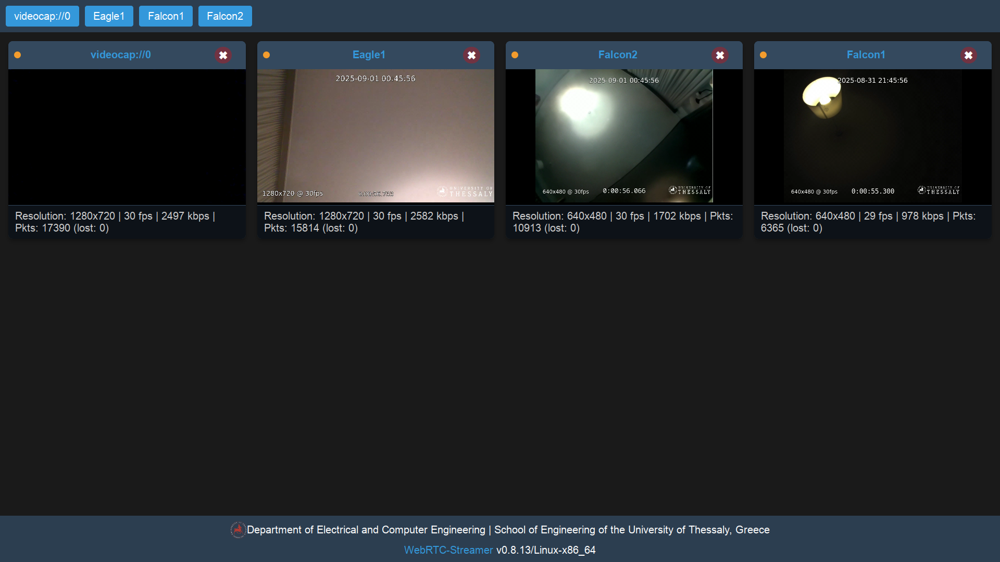

<h1 align="center">UAV Telemetry Dashboard</h1>
<p align="center"><em><small>
A modern web-based dashboard to visualize UAV telemetry, camera feeds, and real-time KLV metadata.  
</small></em></p>



Hybrid **RTSP ingest + WebRTC playback** for low-latency, browser-friendly UAV video on SBCs (Raspberry Pi 4B, Radxa ZERO 3W, Jetson Nano).  
RTSP (via GStreamer) handles reliable camera ingest; **webrtc-streamer** serves the same feeds to any modern browser—no plugins.


## Features
-  LAN-optimized **low latency** (RTSP ingest, WebRTC playback)
-  Works with **software** and **hardware** H.264 encoders
-  **Multi-camera** grid viewer with controls (mute, snapshot, fullscreen, stats)
-  Single binary **gateway** (`webrtc-streamer`) with simple CLI or JSON config
-  Drop-in **custom HTML dashboard** (responsive grid)

## Multi-Stream Gateway

### CLI (multiple `-n`/`-u` pairs)
```bash
./webrtc-streamer -H 0.0.0.0:8000 \
  -n drone1 -u rtsp://192.168.1.15:8555/test \
  -n drone2 -u rtsp://192.168.1.30:8555/test \
  -n drone3 -u rtsp://192.168.1.42:8555/test -s-
```

### JSON config
`config.json`
```json
{
  "urls": {
    "drone1": { "video": "rtsp://192.168.1.15:8555/test" },
    "drone2": { "video": "rtsp://192.168.1.30:8555/test" },
    "drone3": { "video": "rtsp://192.168.1.42:8555/test" }
  }
}
```
Run:
```bash
./webrtc-streamer -C config.json -H 0.0.0.0:8000 -s-
```
## License
   
  This repository is licensed under the MIT License - see the [LICENSE](LICENSE) file for details.


**Thank you for visiting uav-telemetry-dashboard!** 